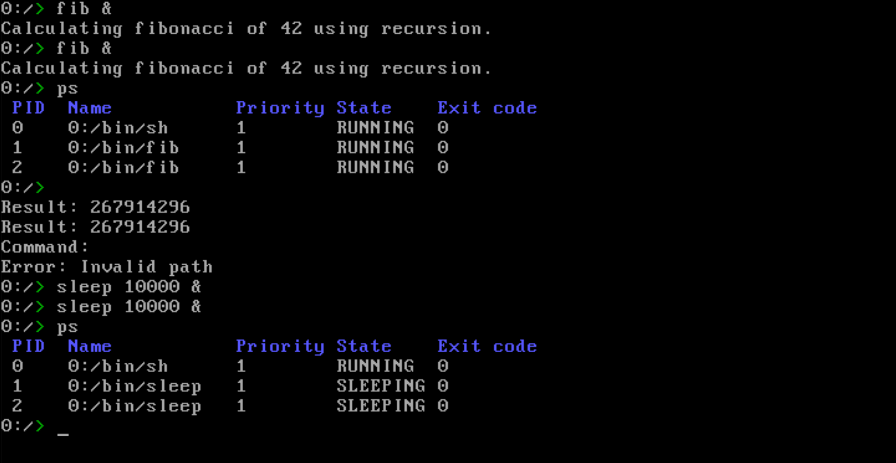
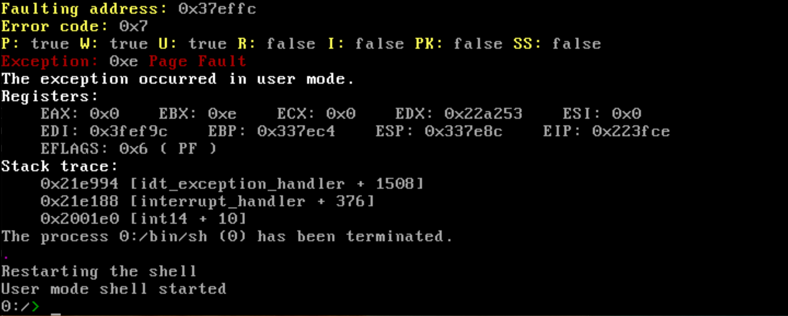

# OS (no name)

Just a little operating system I'm developing for fun.

## Documentation

[Multi-tasking](docs/MULTITASKING.md)  
[Things I learned](docs/THINGS_I_LEARNED.md)

Screenshots

Roadmap

General features

- ✅ Bootloader
- ✅ GRUB compatibility
- ✅ GDT
- ✅ TSS
- ✅ Paging
- ✅ IDT
- ✅ ATA PIO
- ✅ FAT16 - read
- ⬜ FAT16 - write
- ⬜ MBR
- ✅ User mode
- ✅ Idle thread
- ✅ Spinlock
- ⬜ Semaphore
- ✅ Multi-tasking
- ⬜ User mode multi-threading
- ⬜ A better scheduler
- ✅ PS/2 Keyboard
- ⬜ USB
- ✅ ELF loader
- ✅ Binary loader
- ✅ User programs
- ✅ User shell
- ✅ Serial
- ☑️ User standard library (still in progress)
- ✅ Framebuffer text mode
- ⬜ TTY
- ✅ PIT
- ✅ Panic with stack trace
- ⬜ DWARF debugging
- ✅ Undefined behavior sanitizer
- ✅ Stack smashing protector
- ☑️ VFS
- ⬜ Network stack
- ⬜ Make the syscalls more POSIX-like
- ⬜ GUI

Syscalls

- ✅ fork
- ✅ exec
- ✅ create_process
- ✅ exit
- ⬜ kill
- ✅ wait
- ✅ sleep
- ✅ yield
- ✅ getpid
- ✅ open
- ✅ close
- ✅ read
- ⬜ write
- ⬜ lseek
- ✅ fstat
- ✅ getcwd (get_current_directory)
- ✅ chdir (set_current_directory)
- ✅ reboot
- ✅ shutdown
- ✅ malloc
- ✅ free
- ✅ calloc
- ⬜ realloc
- ⬜ brk
- ⬜ sbrk
- ⬜ mmap
- ⬜ munmap
- ✅ print
- ✅ getkey
- ✅ open_dir
- ⬜ dup
- ⬜ dup2
- ⬜ pipe
- ⬜ ioctl
- ⬜ readdir
- ⬜ closedir
- ⬜ signal
- ⬜ sigaction
- ⬜ fcntl
- ⬜ socket
- ⬜ connect
- ⬜ bind
- ⬜ listen
- ⬜ accept
- ⬜ gettimeoftheday
- ⬜ clock_gettime
- ⬜ nanosleep
- ⬜ time
- ⬜ errno
- ⬜ pthread_create

